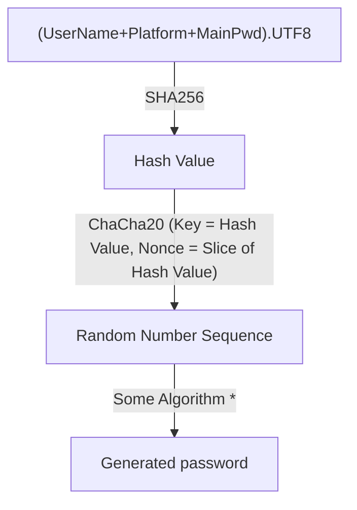

# Developer Document

## Data Flow

### Some Algorithm \*

1. Pick a byte from _Random Number Sequence_, mod 4, to decide character set (up letters, low letters, numbers, special character)
1. Pick a byte from _Random Number Sequence_, mod the length of character set, get a character. (But if the byte is too big, it will be discarded.)
1. All characters join, get generated password.

Related code files: rust/src/api/calculate_password.rs
