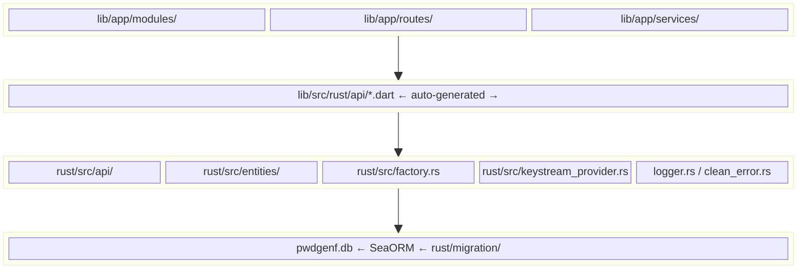
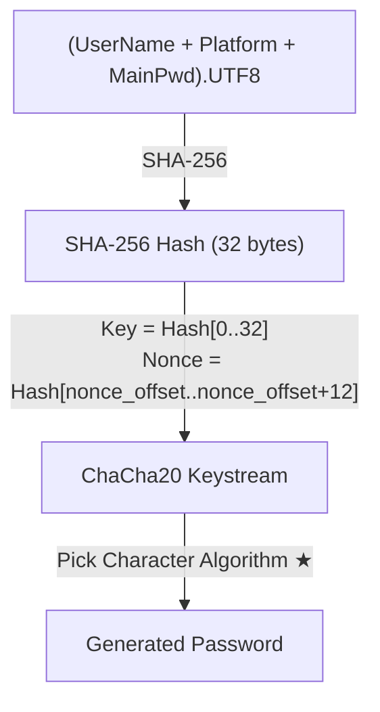

# Developer Document

## 1. Project Overview

**pwdgenf** is a **deterministic password generator** — a cross-platform app that derives passwords on-the-fly from a master password + account metadata using ChaCha20. It **never stores passwords**; only account metadata (username, platform, character-set preferences, etc.) is persisted in a local SQLite database.

| Aspect | Detail |
| --- | --- |
| Platforms | Android, iOS, Windows, macOS, Linux |
| GUI | Flutter (GetX state management) |
| Core Logic | Rust (compiled as `cdylib` + `staticlib`) |
| Bridge | [flutter_rust_bridge](https://cjycode.com/flutter_rust_bridge/) |
| Database | [SeaORM](https://www.sea-ql.org/SeaORM/) + SQLite |

### Core Design Principles

1. **Passwords are never stored** — they are deterministically derived each time the user enters their master password.
2. **Deterministic derivation** — same inputs always produce the same password.
3. **`nonce_offset` for rotation** — changing this parameter (0–19) yields a different password for the same account without changing the master password.
4. **Uniform character distribution** — rejection sampling avoids modulo bias when picking characters.

---

## 2. Project Architecture



### Layer Responsibilities

| Layer | Responsibility |
| --- | --- |
| **GUI** | Screens, forms, navigation, clipboard, i18n (en_US / zh_CN) |
| **Bridge** | Auto-generated Dart bindings from `#[frb]`-annotated Rust functions |
| **Core** | Password derivation algorithm, CRUD operations, logging, DB connection |
| **Storage** | SQLite database for account metadata (no passwords stored) |

### Directory Map

```
pwdgenf/
├── lib/                          # Flutter code
│   ├── main.dart                 # App entry point
│   └── app/
│       ├── modules/              # GetX feature modules
│       │   ├── home/             #   Account list (paginated, searchable)
│       │   ├── acct_detail/      #   View account + generate password
│       │   ├── add_acct/         #   Create new account
│       │   ├── edit_acct/        #   Edit / delete account
│       │   └── settings/         #   Backup, restore, language
│       ├── routes/               # GetX route definitions
│       ├── services/             # AppEnvService, AppConfig, LockUIService
│       └── my_translations.dart  # i18n strings
├── rust/                         # Rust core
│   ├── Cargo.toml
│   ├── src/
│   │   ├── lib.rs                # Module declarations
│   │   ├── api/                  # Public API (bridge entry points)
│   │   │   ├── mod.rs
│   │   │   ├── init.rs           #   App init, logger, migration
│   │   │   ├── calculate_password.rs  # ★ Core algorithm
│   │   │   ├── create_acct_data.rs
│   │   │   ├── read_acct_data.rs
│   │   │   ├── read_all_acct_data.rs
│   │   │   ├── update_acct_data.rs
│   │   │   └── delete_acct_data.rs
│   │   ├── entities/             # SeaORM entity definitions
│   │   ├── factory.rs            # DB connection factory
│   │   ├── keystream_provider.rs # ChaCha20 keystream wrapper
│   │   ├── clean_error.rs        # FFI-safe error type
│   │   └── logger.rs             # Tracing logger
│   └── migration/                # SeaORM schema migrations
├── assets/
│   └── config.example.toml       # Default config template
├── build_workflows/              # Platform build scripts
├── docs/
│   ├── developer_doc.md          # This document
│   └── user_doc.md               # User-facing documentation
└── flutter_rust_bridge.yaml      # Bridge configuration
```

---

## 3. Flutter ↔ Rust

See [flutter_rust_bridge website](https://cjycode.com/flutter_rust_bridge/)

---

## 4. Core Algorithm: Password Derivation

> **Source**: `rust/src/api/calculate_password.rs`

### 4.1 Overview

The password is derived deterministically from three inputs:

- **User Name** (account identifier)
- **Platform** (website / service name)
- **Master Password** (user's secret, never stored)

### 4.2 Data Flow



> [!info]
> ChaCha20 is used purely as a **deterministic random byte stream generator** in this context — not for encryption.

### 4.3 Step-by-Step

#### Step 1: Input Validation

- `user_name`, `platform`, `main_password` must be non-empty.
- `nonce_offset` must be in range `[0, 19]` (ensures 12 bytes available for nonce).
- `pwd_len` must be ≤ 255.
- At least one character set must be enabled.

#### Step 2: Hashing

```
hash = SHA-256( user_name || platform || main_password )
```

Produces a 32-byte digest. This is the **sole source of entropy** for the entire derivation.

#### Step 3: ChaCha20 Initialization

| Parameter | Source |
| --- | --- |
| **Key** (32 bytes) | `hash[0..32]` — the full hash |
| **Nonce** (12 bytes) | `hash[nonce_offset .. nonce_offset+12]` — a sliding window |

The `nonce_offset` parameter (0–19) selects which 12-byte slice of the hash to use as the nonce. Changing this value produces a **completely different keystream**, and thus a different password — enabling password rotation without changing the master password.

#### Step 4: KeystreamProvider

`KeystreamProvider` (in `rust/src/keystream_provider.rs`) wraps the ChaCha20 cipher and provides an infinite stream of pseudo-random bytes:

- Maintains a 64-byte internal buffer.
- When exhausted, applies the cipher to generate the next 64 bytes.
- Tracks total bytes consumed; errors at `MAX_KEY_COUNT` (65535, effectively no practical limit per derivation).

#### Step 5: Pick Character Algorithm ★

For each of the `pwd_len` characters:

```
1. byte = keystream.next()        →  set_index = byte % 4
   ┌───────┬───────────┬──────────┬──────────┐
   │   0   │     1     │    2     │    3     │
   │ Upper │  Lower    │  Digits  │  Special │
   └───────┴───────────┴──────────┴──────────┘

2. If the selected set is disabled → loop back to step 1.

3. byte = keystream.next()        →  uniformly_pick(char_set, byte)

4. Append the picked character to the result.
```

#### Step 6: `uniformly_pick()` — Rejection Sampling

```rust
fn uniformly_pick(char_set: &[char], key: u8) -> char {
    let len = char_set.len() as u8;
    let max_valid = (256 / len) * len;  // largest multiple of len ≤ 256
    if key >= max_valid {
        // Reject: this key would cause modulo bias
        // Caller must retry with a new key
        return REJECT_SIGNAL;
    }
    char_set[(key % len) as usize]
}
```

> [!info]
> **Why rejection sampling?** If we simply used `key % len`, characters at lower indices would appear more frequently when `len` does not evenly divide 256. For example, with a 26-letter alphabet: `256 % 26 = 22`, so indices 0–21 would appear 10 times each while indices 22–25 appear only 9 times. Rejection sampling discards keys in the "incomplete tail" to guarantee uniform distribution.

### 4.4 Character Sets

| Set | Characters | Count |
| --- | --- | --- |
| Uppercase | `A-Z` | 26 |
| Lowercase | `a-z` | 26 |
| Digits | `0-9` | 10 |
| Special | `~!@#$%^&*()_+-=` | 15 |

---

## 5. Database Design

### 5.1 Table: `AcctData`

| Column | Type | Description |
| --- | --- | --- |
| `Id` | `INTEGER` `PK AUTOINCREMENT` | Unique identifier |
| `UserName` | `TEXT` `NOT NULL` | Account username / email |
| `Platform` | `TEXT` `NOT NULL` | Platform or website name |
| `Remark` | `TEXT` | Free-text notes |
| `NonceOffset` | `INTEGER` `DEFAULT 0` | ChaCha20 nonce offset (0–19) |
| `UseUpLetter` | `INTEGER` `DEFAULT 1` | Include uppercase letters |
| `UseLowLetter` | `INTEGER` `DEFAULT 1` | Include lowercase letters |
| `UseNumber` | `INTEGER` `DEFAULT 1` | Include digits |
| `UseSpChar` | `INTEGER` `DEFAULT 1` | Include special characters |
| `PwdLen` | `INTEGER` `DEFAULT 16` | Desired password length |
| `UpdatedAt` | `TEXT` | ISO 8601 timestamp |

> [!important]
> The master password is **never stored** in the database. Only account metadata is persisted.

### 5.2 SeaORM Entity

Defined in `rust/src/entities/acct_data.rs`. The entity uses PascalCase column names to match the SQLite schema. All CRUD operations go through SeaORM's `ActiveModel` pattern.

### 5.3 Migrations

Located in `rust/migration/`. The `Migrator` runs on app startup via `initMigrate()`:

- **`m20260427_000001_create_table.rs`**: Creates the `AcctData` table with all columns.

---

## 6. Flutter Modules (GetX)

Each module follows the GetX pattern: **Binding → Controller → View**.

### 6.1 Route Table

| Route | Path | View | Purpose |
| --- | --- | --- | --- |
| `HOME` | `/home` | `HomeView` | Account list with search & pagination |
| `SETTINGS` | `/settings` | `SettingsView` | Backup, restore, language |
| `ADD_ACCT` | `/add-acct` | `AddAcctView` | Create new account |
| `EDIT_ACCT` | `/edit-acct` | `EditAcctView` | Edit or delete account |
| `ACCT_DETAIL` | `/acct-detail` | `AcctDetailView` | View account + generate password |

All routes use `Transition.cupertino` for page transitions.

### 6.2 Home Module

- **`HomeController`**: Manages `AsyncPaginatedDataTable2` with server-side pagination via `readAllAcctData()`. Supports search by `Platform` or `UserName` (SQL `LIKE`).
- **`HomeView`**: AppBar with search field, data table, FAB to add account, bottom bar with settings.

### 6.3 AcctDetail Module

- **`AcctDetailController`**: Loads full account data by `id`. On "Generate" button press, calls `calculatePassword()` with the account's stored parameters + user-entered master password.
- **`AcctDetailView`**: Read-only display of all fields, master password input field, generated password display with copy-to-clipboard button.

### 6.4 AddAcct / EditAcct Modules

- **`AddAcctController`**: Form with validation. Preview password before saving. Calls `createAcctData()`.
- **`EditAcctController`**: Pre-populated form. Calls `updateAcctData()` on save, `deleteAcctData()` with confirmation dialog on delete.
- Both use `LockUIService.runWithLockUI()` to show a loading overlay during async DB operations.

### 6.5 Settings Module

- **Backup**: Copies `pwdgenf.db` to a user-chosen location via `FilePicker`.
- **Restore**: User picks a `.db` file → copies to app support directory → refreshes home.
- **Language**: Choose between follow-system, en-US, or zh-CN. Persisted in `config.toml`.
- **About**: Bottom sheet with version info and GitHub link.

### 6.6 Services

| Service | File | Purpose |
| --- | --- | --- |
| `AppEnvService` | `app_env_service.dart` | App support directory, download directory, package info |
| `AppConfig` | `app_config.dart` | Load/save `config.toml` (language settings) |
| `LockUIService` | `lock_ui_service.dart` | Modal loading overlay for async operations |

---

## 7. App Initialization Flow

```
main.dart
  │
  ├─ 1. WidgetsFlutterBinding.ensureInitialized()
  ├─ 2. RustLib.init()                    ← FFI bridge setup
  ├─ 3. AppEnvService().init()            ← Determine app support directory
  ├─ 4. AppConfig.fromFile()              ← Load or create config.toml
  ├─ 5. LockUIService                     ← Register in GetX DI
  ├─ 6. initRustLogger()                  ← Start Rust-side tracing logger
  └─ 7. runApp(MyApp())
        │
        └─ HomeController.initDatabase()  ← Runs initMigrate() on first load
```

---

## 8. Logging

Rust-side logging uses the `tracing` ecosystem (`rust/src/logger.rs`):

- **Console output** (stderr): Color-coded by level (red=ERROR, yellow=WARN, green=INFO, blue=DEBUG, gray=TRACE).
- **File output**: Daily rolling log files in `{appSupportDir}/logs/`, max 7 files retained, suffix `.log`.
- **Log level**: Controlled by a verbosity parameter (0=off, 5=trace).

---

## 9. Error Handling

- Rust uses `thiserror` for the `CleanError` type (`rust/src/clean_error.rs`).
- `CleanError` wraps anyhow errors, flattening the error chain into a single `message: String`.
- flutter_rust_bridge auto-generates a matching Dart `CleanError` class.
- All API functions return `Result<T, CleanError>`, which becomes a Dart `Future<T>` that throws on error.

---

## 10. Configuration

`config.toml` is stored in the app support directory. On first run, it's copied from `assets/config.example.toml`:

```toml
follow_system_language = true
language_code = "en"
country_code = "US"
```

---

## 11. Backup & Restore

- **Backup**: Copies the `pwdgenf.db` file to a user-selected location.
- **Restore**: Overwrites the current `pwdgenf.db` with a user-selected `.db` file.
- **Security note**: The backup file only contains account metadata (no passwords), but it does show which services users have accounts on. Pay attention to personal info like phone numbers. The backup isn't encrypted.

---

## 12. Build & Development

### Prerequisites

- Flutter SDK `^3.11.5`
- Rust toolchain (stable) and related cargo cli tools(sea-orm, flutter_rust_bridge_codegen).
- Platform-specific dependencies (see Flutter docs)

### Key Commands

```bash
# Generate bridge code after changing Rust API
flutter_rust_bridge_codegen generate

# Run on desktop
flutter run -d windows   # or macos, linux

# Build release
flutter build apk        # Android
flutter build windows    # Windows
```

### Platform Build Scripts

Located in `build_workflows/`:

| Directory | Platform |
| --- | --- |
| `android/` | Android APK |
| `windows-x86/` | Windows x86_64 |
| `debian-x86/` | Debian/Ubuntu (.deb) |
| `arch-x86/` | Arch Linux (PKGBUILD) |

---

## 13. Key Design Decisions

| Decision | Rationale |
| --- | --- |
| **Deterministic derivation** | No password storage = nothing to steal. Passwords exist only in memory during generation. |
| **ChaCha20 as keystream** | Fast, constant-time, no known weaknesses. Used purely as a CSPRNG, not for encryption. |
| **`nonce_offset` parameter** | Allows password rotation without changing master password or username. |
| **Rejection sampling** | Guarantees uniform character distribution, eliminating modulo bias. |
| **SeaORM + SQLite** | Zero-config embedded database, type-safe queries via SeaORM. |
| **flutter_rust_bridge** | Automatic FFI binding generation — no manual `dart:ffi` code needed. |
| **GetX** | Lightweight state management with built-in routing, DI, and i18n support. |
| **No encryption on backup** | Trade-off: simplicity vs. confidentiality of the account list. Users who need encrypted backups should use full-disk encryption or a separate encrypted container(e.g. Encrypted ZIP file). |
